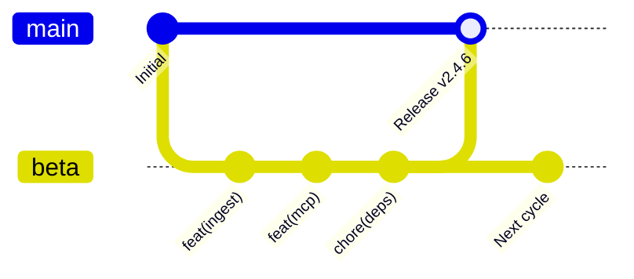

# Governance Model: Zyrabit SLM

This document outlines the governance model, decision-making framework, contributor roles, and release cadence for **Zyrabit SLM** and the **Zyrabit Platform**.

---

## 1. Principles and Vision

Zyrabit SLM is dedicated to building **100% sovereign, private, and air-gapped AI infrastructure**. Our governance is guided by four foundational tenets:

1. **Sovereignty First:** User data must never leave the local boundary without explicit cryptographic authorization. No telemetry with PII; no covert network egress.
2. **Open-Core Transparency:** Architectural decisions, security threat models, and code validation standards are public and verifiable.
3. **Meritocratic Community:** Contributions are welcomed from all engineers, researchers, and hobbyists. Quality, test coverage, and security invariants determine technical acceptance.
4. **Hardware Democratization:** High-performance SLM execution on commodity CPUs, open accelerators (e.g., RISC-V / Tenstorrent), and personal workstations—not just multi-GPU hyperscale clusters.

---

## 2. Roles and Responsibilities

### 👑 Project Lead / Benevolent Maintainer
* **Lead:** Abraham Gómez ([@Abraham1432](https://github.com/Abraham1432))
* **Responsibilities:**
  - Overall architectural direction and strategic alignment.
  - Final arbitration on contested technical decisions and design trade-offs.
  - Release management and cryptographic signing of production tags (`main` branch).
  - Administration of organization repositories, CI secrets, and container registries.

### 🛡️ Core Maintainers
* Community members with sustained, high-quality contributions across domains (Inference, Security, RAG, Frontend).
* **Responsibilities:**
  - Triage issues, review pull requests, and maintain test/CI health.
  - Ensure strict adherence to [SECURITY.md](SECURITY.md) and [CODE_OF_CONDUCT.md](CODE_OF_CONDUCT.md).
  - Guide and mentor new contributors on `good first issue` and `help wanted` tasks.

### 🤝 Contributors
* Anyone who submits code, documentation, benchmarks, bug reports, or translations via Pull Requests or Issues.
* Contributors who practice responsible security disclosure are honored in the **Security Hall of Fame** ([SECURITY.md](SECURITY.md)).

---

## 3. Decision-Making Process

### Consensus-Driven Development
We follow a rough consensus model. Technical proposals and feature requests should begin as a GitHub Issue or GitHub Discussion.

* **Minor Changes & Bug Fixes:** Require approval from at least one Maintainer and a passing CI suite before merging to `beta`.
* **Major Architectural Changes (ADRs):** New services, core pipeline refactors, or telemetry modifications require an RFC (Request for Comments) discussion and approval from the Project Lead.
* **Deadlock Resolution:** If consensus cannot be reached, the Project Lead holds final deciding authority.

---

## 4. Pull Request & Review SLA

To ensure a welcoming, dynamic experience for external contributors:

* **First Response SLA:** Maintainers strive to review and provide initial feedback on all incoming Pull Requests within **5 business days**.
* **Review Criteria:**
  - **Clean CI:** Zero lint errors, 100% test pass rate in pytest, Docker build verification, and clean security audits (`pip-audit` + Trivy).
  - **Zero Regression:** Invariant tests (`dockerfiles.lock.json`, PII abstention gates) must remain uncompromised.
  - **Documentation:** Any modified public interface must be documented in `docs-portal` or README.

---

## 5. Branching and Release Cadence

We adhere to a strict **Dual-Channel Git Flow**:

1. **`beta` Branch (Staging / Integration Channel):**
   - All feature and chore PRs target `beta`.
   - Rapid iteration, pre-release container builds (`:beta`, `:beta-<version>`), and integration smoke testing happen here.
2. **`main` Branch (Production Stable Channel):**
   - Merges to `main` strictly originate from `beta` via formal release PRs.
   - Enforces even-minor semantic versioning (`v2.4.x`, `v2.6.x`).
   - Automatically builds immutable production multi-arch container images (`amd64` + `arm64`) on Docker Hub and GitHub Container Registry (GHCR).

---

## 6. Sponsoring and Financial Transparency

Zyrabit operates under a transparent open-core financial model:
* Financial sponsorships via **GitHub Sponsors** and **OpenCollective** directly support:
  - CI/CD runner infrastructure (native ARM64 / GPU runners).
  - Community bounties for critical `help wanted` issues.
  - Hardware testing labs (Apple Silicon, Tenstorrent Blackhole, RISC-V devboards).
* Financial accounting is maintained with public transparency for all institutional and individual backers.

---

## 7. Conflict Resolution & Code of Conduct

All interactions within the Zyrabit ecosystem are governed by our [Contributor Covenant Code of Conduct](CODE_OF_CONDUCT.md).

For moderation concerns or private reporting of conduct violations, contact the leadership team at **gomezabraham1432@gmail.com**.
