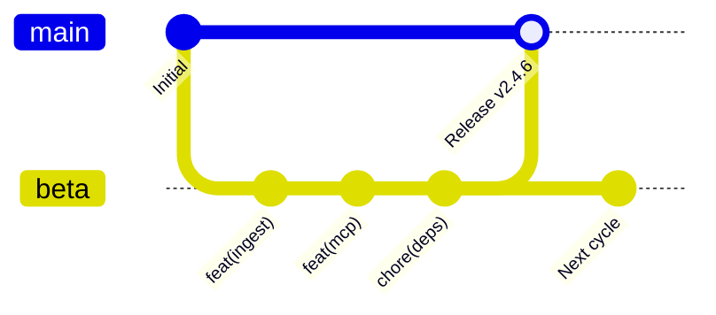

# Governance Model: Zyrabit SLM

This document describes how **Zyrabit SLM** is maintained today. It names the people and the money channels that exist, and it does not describe roles or funds that are not there yet.

---

## 1. Principles

1. **Sovereignty First:** User data stays inside the deployment boundary. Telemetry carries no prompts, documents, or personal identifiers. A test that reaches the network is a bug.
2. **Public Code:** Architecture, threat notes, and validation rules live in this repository. The license is MIT.
3. **Acceptance by Evidence:** A change is accepted when tests pass, security invariants hold, and the project lead merges it. There is no vote.
4. **Hardware Reach:** The software should run on commodity CPUs, personal workstations, and the accelerators we can actually test (Apple Silicon, NVIDIA, Tenstorrent).

---

## 2. Roles

### Project Lead

* **Lead:** Abraham Gómez ([@Abraham1432](https://github.com/Abraham1432)), ZYRABIT LTD.
* **Decides:** architecture, what gets merged, releases, and the `main` branch.
* **Operates:** organization repositories, CI secrets, and container registries.

### Maintainers

None yet. A maintainer seat opens when someone has merged several pull requests that touch tests and security, and the lead adds them here by name. Until that line has a name, review and triage sit with the lead.

### Contributors

Anyone who sends code, documentation, benchmarks, or a bug report. Security reports that follow [SECURITY.md](SECURITY.md) are credited in the Security Hall of Fame.

---

## 3. How Decisions Are Made

Proposals start as a GitHub issue.

* **Bug fixes and small changes** need a passing CI run and the lead's merge.
* **A new service, a trust-boundary change, or a telemetry change** starts as an issue. The lead has to accept that issue before the corresponding pull request is merged.
* **Disagreement** is resolved by the lead. There is no second committee.

---

## 4. Review

The lead reviews pull requests. There is no published response deadline.

A pull request is mergeable when:

- CI is green: tests, Docker build, and the security audit (`pip-audit`).
- Invariant checks still hold (`dockerfiles.lock.json`, PII and abstention tests).
- A changed public interface is described in `docs-portal` or the README.

---

## 5. Branching and Release Cadence

1. **`beta`** is the integration branch. Feature and chore pull requests target `beta`.
2. **`main`** receives merges from `beta` through a release pull request. A release builds immutable multi-arch images (`amd64` and `arm64`) on Docker Hub and GHCR.

---

## 6. Money

The project does not pay bounties and does not run a hardware lab on donated funds.

The public ledger is [Open Collective: Zyrabit Open Source](https://opencollective.com/zyrabit). As of 3 October 2026 that collective shows a balance of $0, yearly income of $0, and 0 backers. Expenses, if any arrive, will show on that page.

GitHub Sponsors is not an active channel. Neither [@Abraham1432](https://github.com/Abraham1432) nor the `Zyrabit-tech` organization has a Sponsors listing. The repository does not advertise one.

If money is received later, it is for CI minutes and for hardware used to test this repository. That sentence becomes true only after a transaction exists on the Open Collective page.

Commercial contact for the company is separate from project donations: **contact@zyrabit.com**.

---

## 7. Conduct

Interaction in this repository follows the [Contributor Covenant Code of Conduct](CODE_OF_CONDUCT.md).

Report conduct problems to **contact@zyrabit.com**. The project lead reads that mailbox.
