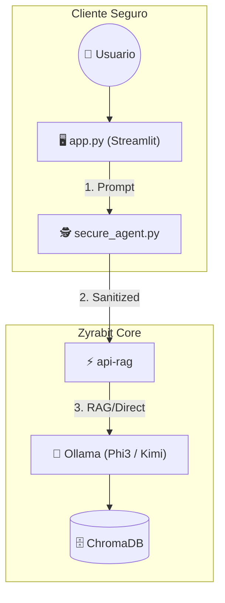

# Zyrabit SLM Secure Suite (v1.0‑beta)

[](README_EN.md)


---

## 📖 Descripción

**Zyrabit SLM Secure Suite** es una solución de IA local que combina un modelo de lenguaje grande (Ollama) con un motor de recuperación‑aumentada (RAG) y una capa de **Zero‑Trust** que sanitiza cualquier dato sensible antes de enviarlo al modelo. El proyecto está pensado para ejecutarse en entornos locales (Mac M1 Pro, Linux, Windows WSL2) sin depender de la nube, garantizando privacidad y cumplimiento de normativas.

---

## 🏗️ Arquitectura



---

## 🛠️ Entorno Validado

| Plataforma | CPU | RAM | OS |
|------------|-----|-----|----|
| MacBook Pro (M1 Pro) | 8‑core | 16 GB | macOS Sequoia 15.1 |
| Linux (Ubuntu 22.04) | 4‑core | 8 GB | - |
| Windows (WSL2) | 4‑core | 8 GB | - |

> **Nota Windows:** Use WSL2 para ejecutar Docker y los scripts.

---

## 📦 Instalación

1. **Prerequisitos**
   - Docker & Docker‑Compose
   - Python 3.10 +
   - `git` (opcional)
2. **Clonar el repositorio**
   ```bash
   git clone https://github.com/zyrabit/zyrabit-SLM.git
   cd zyrabit-SLM
   ```
3. **Entorno virtual**
   ```bash
   python -m venv .venv
   source .venv/bin/activate   # macOS / Linux
   # .venv\Scripts\activate   # Windows
   pip install -r requirements.txt
   ```
4. **Infraestructura**
   ```bash
   docker compose up -d   # levanta SLM‑server, vector‑db y api‑rag
   ```
5. **Descargar modelos obligatorios**
   ```bash
   ./setup_ollama.sh   # verifica Docker, arranca SLM‑server y descarga phi3, kimi‑k2‑thinking:cloud y mxbai‑embed‑large
   ```
6. **Ejecutar la UI**
   ```bash
   streamlit run app.py
   ```
   Accede a `http://localhost:8501`.

---

## 🚀 Uso rápido

```bash
# CLI segura
python secure_agent.py "Mi email es juan@example.com y mi saldo es $1,200.00"
```

El agente mostrará el prompt original, el prompt sanitizado y la respuesta del modelo.

---

## 🧪 Tests

Ejecuta la suite de pruebas con:
```bash
pytest -q
```
Los tests cubren la sanitización de PII y la correcta respuesta del backend.

---

## 📜 Licencia

MIT © Zyrabit 2025