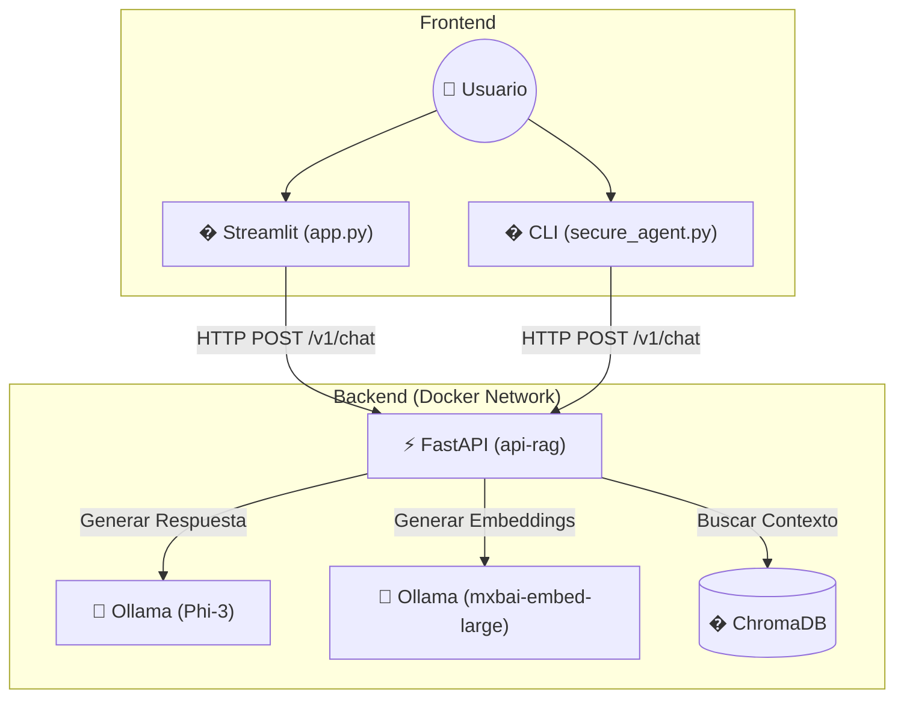

# Zyrabit LLM Secure Suite
[](README_EN.md)


**Zyrabit LLM Secure Suite** es una arquitectura de referencia para desplegar agentes de IA generativa seguros y privados en entornos empresariales. Combina la potencia de **Ollama (Phi-3)** con una capa de seguridad intermedia que sanitiza datos sensibles antes de que toquen el LLM.

## Arquitectura

El proyecto se divide en dos componentes principales:

1.  **Frontend (Raíz)**:
    *   `app.py`: Dashboard de Streamlit para interacción con el usuario.
    *   `secure_agent.py`: Agente CLI para pruebas rápidas y seguras.
2.  **Backend (`zyrabit-brain-api`)**:
    *   `api-rag/`: API FastAPI que orquesta la lógica de RAG, conecta con ChromaDB y Ollama.



## Propuesta de Valor

1.  **Privacidad por Diseño**: Ningún dato PII (Emails, Teléfonos, Tarjetas de Crédito) llega al modelo de lenguaje. El agente seguro actúa como un firewall de datos.
2.  **Soberanía de Datos**: Ejecución 100% local u on-premise utilizando modelos eficientes como Phi-3.
3.  **Observabilidad Completa**: Stack de monitoreo integrado para trazar latencia, uso de tokens y errores en tiempo real.
4.  **Arquitectura Modular**: Componentes desacoplados (Cliente, API, LLM, VectorDB) que permiten escalar independientemente.

## Instalación

### Prerrequisitos
*   Docker & Docker Compose
*   Python 3.10+
*   Ollama (para ejecución local sin Docker)

### Pasos Rápidos

1.  **Clonar el repositorio**:
    ```bash
    git clone https://github.com/Zyrabit-tech/zyrabit-llm.git
    cd zyrabit-llm
    ```

2.  **Configurar Entorno**:
    ```bash
    # Instalar dependencias de Python
    pip install -r requirements.txt
    
    # Configurar Ollama y descargar modelos (phi3 + mxbai-embed-large)
    chmod +x setup_ollama.sh
    ./setup_ollama.sh
    ```

3.  **Ingesta de Documentos (RAG)**:
    Para alimentar la memoria vectorial con tus propios documentos, utiliza el endpoint de la API:

    **Opción A: Vía cURL**
    ```bash
    curl -X POST "http://localhost:8080/v1/ingest" \
         -H "accept: application/json" \
         -H "Content-Type: multipart/form-data" \
         -F "file=@/ruta/a/tu/documento.pdf"
    ```

    **Opción B: Vía Interfaz Swagger**
    1.  Abre `http://localhost:8080/docs` en tu navegador.
    2.  Busca el endpoint `POST /v1/ingest`.
    3.  Sube tu archivo PDF (Máx 800MB).

    El sistema procesará el PDF, generará embeddings con `mxbai-embed-large` y los guardará en ChromaDB automáticamente.

4.  **Ejecutar Agente Seguro**:
    ```bash
    python3 secure_agent.py
    ```

## Contribución

¡Queremos tu ayuda para hacer Zyrabit LLM mejor!
Por favor lee nuestras [Guías de Contribución](CONTRIBUTING.md) para conocer nuestro flujo de trabajo, convención de commits y cómo empezar.

**Recuerda**: Los Pull Requests deben apuntar a la rama `beta`.

## Troubleshooting

*   **Error de conexión con Ollama**: Asegúrate de que Ollama esté corriendo (`ollama serve`) y escuchando en el puerto 11434.
*   **Modelo no encontrado**: Ejecuta `./setup_ollama.sh` para asegurar que `phi3` y `mxbai-embed-large` estén descargados.
*   **Permisos de ejecución**: Si `setup_ollama.sh` falla, asegúrate de haber ejecutado `chmod +x setup_ollama.sh`.

______________________

# Run The App chat

```bash 
streamlit run app.py
```