# Zyrabit LLM Secure Suite


**Zyrabit LLM Secure Suite** es una arquitectura de referencia para desplegar agentes de IA generativa seguros y privados en entornos empresariales. Combina la potencia de **Ollama (Phi-3)** con una capa de seguridad intermedia que sanitiza datos sensibles antes de que toquen el LLM.

## Arquitectura

```mermaid
graph TD
    subgraph "Cliente Seguro (Python Local)"
        User((👤 Usuario))
        Agent["🕵️ secure_agent.py<br/>(Sanitizer Regex/NER)"]
        UI["🖥️ app.py<br/>(Streamlit Dashboard)"]
    end

    subgraph "Zyrabit Core (Docker Network)"
        API["⚡ api-rag<br/>(FastAPI Gateway)"]
        LLM["🧠 llm-server<br/>(Ollama - Phi3)"]
        VectorDB[("🗄️ ChromaDB<br/>Memoria Vectorial")]
        Monitor["📊 Grafana + Prometheus<br/>Observabilidad"]
    end

    User --> UI
    UI -->|1. Prompt Crudo| Agent
    Agent -->|2. Datos Redacted| API
    API -->|3. Query Vectorial| VectorDB
    VectorDB -->|4. Contexto| API
    API -->|5. Prompt Final| LLM
    LLM -->|6. Respuesta| API
    API -->|7. Display Seguro| UI

    style Agent fill:#ff9900,stroke:#333,stroke-width:2px
    style LLM fill:#99ff99,stroke:#333,stroke-width:2px
```



## Propuesta de Valor

1.  **Privacidad por Diseño**: Ningún dato PII (Emails, Teléfonos, Tarjetas de Crédito) llega al modelo de lenguaje. El agente seguro actúa como un firewall de datos.
2.  **Soberanía de Datos**: Ejecución 100% local u on-premise utilizando modelos eficientes como Phi-3.
3.  **Observabilidad Completa**: Stack de monitoreo integrado para trazar latencia, uso de tokens y errores en tiempo real.
4.  **Arquitectura Modular**: Componentes desacoplados (Cliente, API, LLM, VectorDB) que permiten escalar independientemente.

## Instalación

### Prerrequisitos
*   Docker & Docker Compose
*   Python 3.10+
*   Ollama (para ejecución local sin Docker)

### Pasos Rápidos

1.  **Clonar el repositorio**:
    ```bash
    git clone https://github.com/tu-org/zyrabit-llm.git
    cd zyrabit-llm
    ```

2.  **Configurar Entorno**:
    ```bash
    # Instalar dependencias de Python
    pip install -r requirements.txt
    
    # Configurar Ollama y descargar modelo
    chmod +x setup_ollama.sh
    ./setup_ollama.sh
    ```

3.  **Ejecutar Agente Seguro**:
    ```bash
    python3 secure_agent.py
    ```

## Troubleshooting

*   **Error de conexión con Ollama**: Asegúrate de que Ollama esté corriendo (`ollama serve`) y escuchando en el puerto 11434.
*   **Modelo no encontrado**: Ejecuta `./setup_ollama.sh` para asegurar que `phi3` esté descargado.
*   **Permisos de ejecución**: Si `setup_ollama.sh` falla, asegúrate de haber ejecutado `chmod +x setup_ollama.sh`.