# Zyrabit LLM Secure Suite


**Zyrabit LLM Secure Suite** is a reference architecture for deploying secure and private Generative AI agents in enterprise environments. It combines the power of **Ollama (Phi-3)** with an intermediate security layer that sanitizes sensitive data before it touches the LLM.

## Architecture

```mermaid
graph TD
    subgraph "Secure Client (Local Python)"
        User((👤 User))
        Agent["🕵️ secure_agent.py<br/>(Sanitizer Regex/NER)"]
        UI["🖥️ app.py<br/>(Streamlit Dashboard)"]
    end

    subgraph "Zyrabit Core (Docker Network)"
        API["⚡ api-rag<br/>(FastAPI Gateway)"]
        LLM["🧠 llm-server<br/>(Ollama - Phi3)"]
        VectorDB[("🗄️ ChromaDB<br/>Vector Memory")]
        Monitor["📊 Grafana + Prometheus<br/>Observability"]
    end

    User --> UI
    UI -->|1. Raw Prompt| Agent
    Agent -->|2. Redacted Data| API
    API -->|3. Vector Query| VectorDB
    VectorDB -->|4. Context| API
    API -->|5. Final Prompt| LLM
    LLM -->|6. Response| API
    API -->|7. Secure Display| UI

    style Agent fill:#ff9900,stroke:#333,stroke-width:2px
    style LLM fill:#99ff99,stroke:#333,stroke-width:2px
```



## Value Proposition

1.  **Privacy by Design**: No PII data (Emails, Phones, Credit Cards) reaches the language model. The secure agent acts as a data firewall.
2.  **Data Sovereignty**: 100% local or on-premise execution using efficient models like Phi-3.
3.  **Full Observability**: Integrated monitoring stack to trace latency, token usage, and errors in real-time.
4.  **Modular Architecture**: Decoupled components (Client, API, LLM, VectorDB) allowing independent scaling.

## Installation

### Prerequisites
*   Docker & Docker Compose
*   Python 3.10+
*   Ollama (for local execution without Docker)

### Quick Start

1.  **Clone the repository**:
    ```bash
    git clone https://github.com/your-org/zyrabit-llm.git
    cd zyrabit-llm
    ```

2.  **Setup Environment**:
    ```bash
    # Install Python dependencies
    pip install -r requirements.txt
    
    # Setup Ollama and download model
    chmod +x setup_ollama.sh
    ./setup_ollama.sh
    ```

3.  **Run Secure Agent**:
    ```bash
    python3 secure_agent.py
    ```

## Troubleshooting

*   **Ollama Connection Error**: Ensure Ollama is running (`ollama serve`) and listening on port 11434.
*   **Model Not Found**: Run `./setup_ollama.sh` to ensure `phi3` is downloaded.
*   **Execution Permissions**: If `setup_ollama.sh` fails, make sure you ran `chmod +x setup_ollama.sh`.
