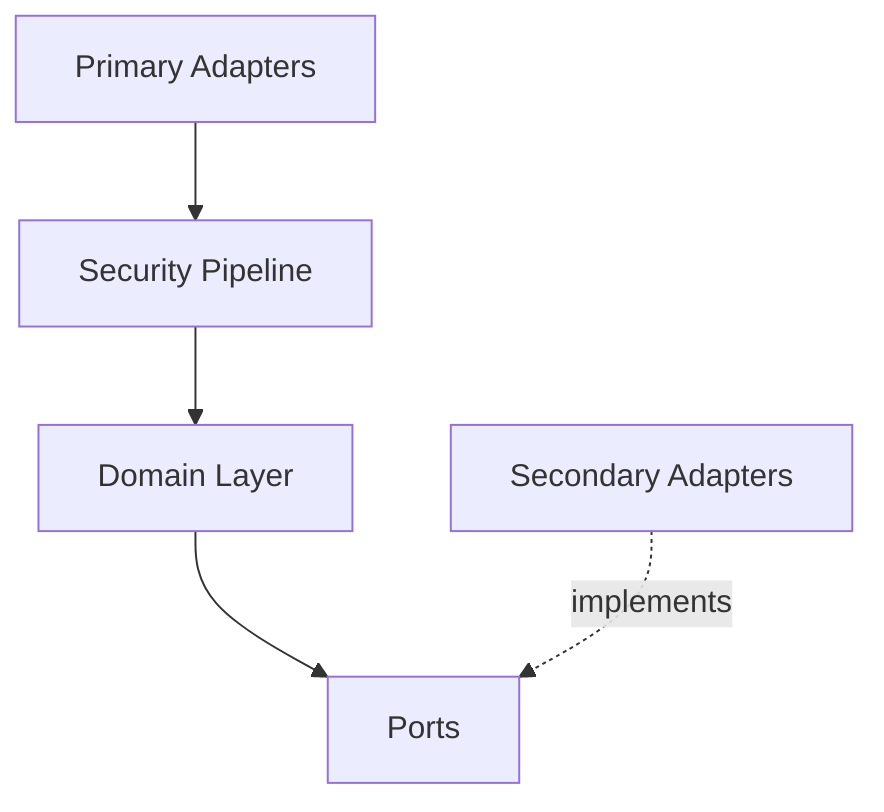

# AI Context

This document serves as a machine-readable reference of the Zyrabit SLM architecture for AI coding assistants.

## Hexagonal Schema

```json
{
  "project": "Zyrabit SLM",
  "architecture": "Hexagonal (Ports and Adapters)",
  "layers": {
    "domain": ["use_cases", "services"],
    "ports": ["InferencePort", "StreamingInferencePort", "VectorStorePort", "McpClientPort"],
    "adapters": ["OllamaInferenceAdapter", "ChromaAdapter", "InternalMcpClientAdapter"]
  }
}
```

## File Path Reference

- **Domain Logic**: `api-rag/app/domain/`
- **Ports**: `api-rag/app/ports/`
- **Adapters**: `api-rag/app/infrastructure/`
- **FastAPI Endpoints**: `api-rag/app/api/v1/endpoints/`
- **Wiring (DI)**: `api-rag/app/wiring.py`

## Architecture Diagram



## Environment Variables

| Variable | Description |
|----------|-------------|
| `INFERENCE_PROVIDER` | Selects the active Inference Adapter (e.g., ollama, mlx) |
| `VECTOR_STORE` | Selects the active Vector Store Adapter (e.g., chroma) |
| `MODEL_NAME` | Active text generation model |
