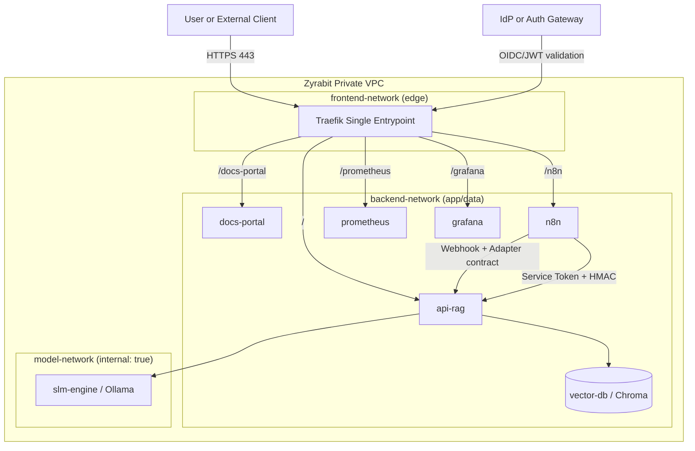

# Architecture Diagram (Mermaid)

```mermaid
flowchart TB
    U[User or External Client] -->|HTTPS 443| T[Traefik Single Entrypoint]

    subgraph VPC["Zyrabit Private VPC"]
      direction TB

      subgraph FE["frontend-network (edge)"]
        T
      end

      subgraph BE["backend-network (app/data)"]
        A[api-rag]
        D[docs-portal]
        N[n8n]
        P[prometheus]
        G[grafana]
        C[(vector-db / Chroma)]
      end

      subgraph MO["model-network (internal: true)"]
        S[slm-engine / Ollama]
      end
    end

    T -->|/| A
    T -->|/docs-portal| D
    T -->|/n8n| N
    T -->|/prometheus| P
    T -->|/grafana| G

    N -->|Webhook + Adapter contract| A
    A --> C
    A --> S

    IDP[IdP or Auth Gateway] -->|OIDC/JWT validation| T
    N -->|Service Token + HMAC| A
```
