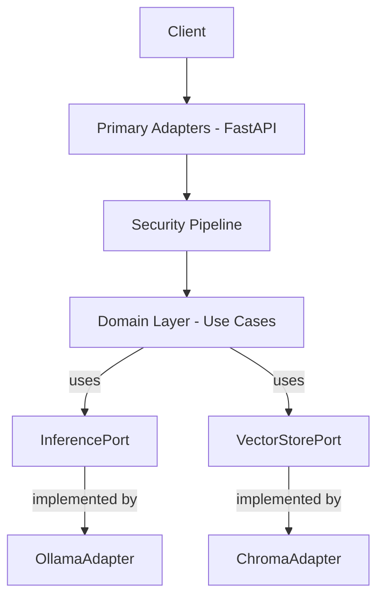

# Zyrabit Hexagonal Architecture

Zyrabit SLM applies **Hexagonal Architecture (Ports & Adapters)** to ensure the core domain logic is completely decoupled from infrastructure concerns (databases, LLM engines, transport protocols). 

> [!NOTE]
> This pattern ensures technology independence, high testability, and data sovereignty flexibility by making every external dependency swappable.

import BrowserOnly from '@docusaurus/BrowserOnly';

<BrowserOnly>{() => { const ArchitectureDiagram = require('@site/src/components/ArchitectureDiagram').default; return <ArchitectureDiagram />; }}</BrowserOnly>

## Why Hexagonal?

- **Testability**: Core use cases can be tested in isolation using mock ports.
- **Swappability**: Change LLMs (Ollama to vLLM) or databases (Chroma to Postgres) without touching business logic.
- **Vendor Independence**: Prevents lock-in by defining interactions via our own interfaces.

## Layers

### 1. Primary Adapters (Driving)
The triggers that start the application's work (e.g., FastAPI REST endpoints, Socket.IO handlers).

### 2. Security Pipeline
Runs BEFORE domain logic on every inbound request. Responsible for PII anonymization.

### 3. Domain Layer
Contains Use Cases (e.g., `ChatUseCase`, `IngestUseCase`) and Domain Services (e.g., `Gatekeeper`, `HybridRetrieverService`).

### 4. Ports
Abstract contracts that the domain depends on.

```python
# Example: InferencePort interface
from typing import Protocol, Dict, Any

class InferencePort(Protocol):
    def generate(self, prompt: str, context: list) -> str:
        ...
```

### 5. Secondary Adapters (Driven)
Infrastructure implementations of the ports (e.g., `OllamaInferenceAdapter`, `ChromaAdapter`).

## AI Consumable Diagram

<details>
<summary>View Architecture Diagram (Mermaid)</summary>


</details>

## Next Steps
- Learn how to [Swap Database](../guides/swap-database.md)
- Learn how to [Configure Models](../guides/swap-models.md)
