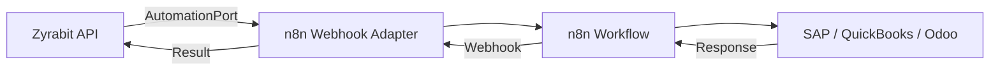

# ERP Integration

> [!NOTE]
> Direct ERP adapters are on the roadmap. The current recommended approach uses **n8n webhooks** through the `AutomationPort`.

## Current Approach: n8n Webhooks

Zyrabit can connect to any ERP system through n8n workflow automation. The `AutomationPort` defines the contract for external integrations:

```python
class AutomationPort(ABC):
    """Contract for external automation integrations."""

    @abstractmethod
    async def send_webhook(self, payload: dict, target_url: str) -> dict:
        """Send data to an external system via webhook."""
        ...

    @abstractmethod
    async def validate_signature(self, request: Request) -> bool:
        """Validate HMAC signature on incoming webhooks."""
        ...
```

### How It Works



1. A chat query or document event triggers the `AutomationPort`
2. The `n8nWebhookAdapter` sends an HMAC-signed webhook to your n8n instance
3. n8n routes the request to your ERP (SAP, QuickBooks, Odoo, custom)
4. The response flows back through the same path

### Setup

1. Configure n8n in your stack: `./zyra.sh install` includes n8n by default
2. Create a webhook workflow in n8n pointing to your ERP
3. Set the webhook URL in `.env`:
   ```
   N8N_WEBHOOK_URL=http://n8n:5678/webhook/your-erp-flow
   N8N_WEBHOOK_SECRET=your-hmac-secret
   ```

## Roadmap: Direct ERP Adapters

Future versions will include dedicated adapters implementing `AutomationPort` for:

| ERP | Status | Adapter |
|---|---|---|
| **SAP Business One** | 🔮 Planned | `SapB1Adapter` |
| **QuickBooks** | 🔮 Planned | `QuickBooksAdapter` |
| **Odoo** | 🔮 Planned | `OdooAdapter` |
| **Custom REST** | ✅ Available | via n8n webhooks |

> [!TIP]
> You can build your own ERP adapter today by implementing the `AutomationPort` interface. See the [Integration Playbook](./integration-playbook.md) for patterns and the [Hexagonal Architecture](./architecture/hexagonal.md) guide for how adapters work.

## Related Documentation

- [Integration Playbook](./integration-playbook.md) — Standards for external integrations
- [Hexagonal Architecture](./architecture/hexagonal.md) — How ports and adapters enable pluggability
- [Telegram Bridge](./telegram-bridge.md) — Another integration example using the same pattern
