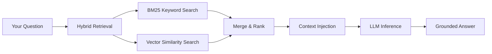

# Your First RAG Query

This tutorial walks you through uploading a document, understanding how it gets processed, and querying it with Retrieval-Augmented Generation (RAG).

## What is RAG?

**Retrieval-Augmented Generation** combines a language model with a retrieval system. Instead of relying solely on the model's training data, RAG fetches relevant context from *your* documents and injects it into the prompt — producing answers grounded in your actual data.



> [!TIP]
> Zyrabit uses **hybrid retrieval** — combining BM25 keyword matching with vector similarity search — for significantly better recall than either method alone.

---

## Step 1: Start the Stack

Make sure your Zyrabit stack is running:

```bash
./zyra.sh start
```

Verify health:

```bash
curl http://localhost:8080/v1/health
```

Expected response:

```json
{"status": "healthy", "chroma": "connected", "inference": "connected"}
```

---

## Step 2: Upload a Document

Upload a PDF, DOCX, or text file via the API:

```bash
curl -X POST http://localhost:8080/v1/ingest \
  -H "Authorization: Bearer $ZYRABIT_API_KEY_MCP" \
  -F "file=@/path/to/your/document.pdf"
```

Or simply drag and drop files into the Web UI at `http://localhost:8080`.

### What Happens Behind the Scenes

When you upload a document, Zyrabit processes it through this pipeline:

1. **Document Parsing** — The `DocumentUseCase` detects the file type and applies the correct strategy (PDF, DOCX, TXT, audio transcription via Whisper).
2. **Chunking** — The document is split into overlapping chunks optimized for retrieval.
3. **Embedding** — Each chunk is converted to a vector embedding using the configured embedding model.
4. **Indexing** — Vectors are stored in ChromaDB (or your configured vector store). A BM25 index is also built in memory for keyword matching.

> [!NOTE]
> Audio files (`.mp3`, `.wav`, `.m4a`) are automatically transcribed using Whisper before being chunked and indexed. No extra configuration needed.

---

## Step 3: Query with RAG

Now ask a question about your uploaded document:

```bash
curl -X POST http://localhost:8080/v1/chat \
  -H "Authorization: Bearer $ZYRABIT_API_KEY_MCP" \
  -H "Content-Type: application/json" \
  -d '{"text": "What are the key findings in the report?"}'
```

### The RAG Pipeline in Action

When your query hits the API, here's what happens inside `ChatUseCase.execute()`:

1. **PII Masking** — The `Gatekeeper` scans your input for PII (emails, phone numbers, credit cards) and replaces them with tokens like `<USER_EMAIL_1>`.
2. **Routing** — The `Gatekeeper` decides: `"rag"` (query needs document context) or `"direct"` (general question).
3. **Hybrid Retrieval** — If routed to RAG, the `HybridRetrieverService` runs both:
   - **BM25** — keyword-based search across the in-memory index
   - **Vector Search** — cosine similarity search in ChromaDB
   - Results are fused and ranked by relevance
4. **Context Injection** — The top chunks are injected into the system prompt as context.
5. **Inference** — The composed prompt is sent to the local LLM via the `InferencePort`.
6. **PII De-anonymization** — Tokens like `<USER_EMAIL_1>` are replaced back with original values before returning.
7. **Caching** — The response is cached by `client_msg_id` to prevent duplicate processing.

---

## Expected Response

```json
{
  "response": "Based on the uploaded report, the key findings include...",
  "sources": [
    {"chunk": "...", "score": 0.89},
    {"chunk": "...", "score": 0.85}
  ]
}
```

---

## Next Steps

- Learn about the [Hexagonal Architecture](./architecture/hexagonal.md) that makes this pipeline modular
- [Swap the database](./guides/swap-database.md) from ChromaDB to PostgreSQL/pgvector
- [Configure models](./guides/swap-models.md) for different inference providers
- Explore the full [API Reference](./api-reference.md)
