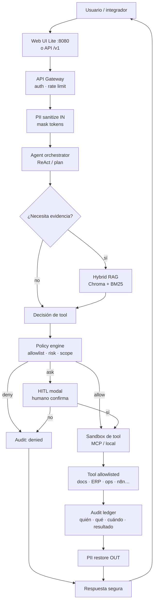

# Mapa: runtime de agentes con tools (Zyrabit)

**Rama / contexto:** `feat/unified-distribution` · Lite-first · soberano  
**Relacionado:** [`DX_SIMPLIFICATION_PLAN.md`](./DX_SIMPLIFICATION_PLAN.md), MCP (`mcp/`), ReAct + HITL (backlog UI)  
**Propósito:** modelo mental de cómo queda el agente que *hace cosas*, alineado con lo que ya estamos construyendo — sin vertical ofensivo.

---

## 1. Una línea

El usuario habla con la UI/API → el runtime **enmascara PII** → el agente propone un tool → una **policy** decide allow / deny / ask-human → el tool corre en **sandbox** → todo queda en **audit** → la respuesta vuelve (PII restore) con citas si hubo RAG.

No es “el modelo ejecuta lo que quiera”. Es **operador con llaves, jaula y bitácora**.

---

## 2. Diagrama (flujo feliz)



---

## 3. Capas vs lo que ya existe / vamos a crear

| Capa | Qué es | Hoy en el repo | Lite path | Platform / después |
|---|---|---|---|---|
| **Ingress** | UI + API | `web-ui`, FastAPI `api-rag`, all-in-one `:8080` | Un puerto, un contenedor | Compose + Traefik |
| **Trust boundary** | Auth + PII sandwich | PII pipeline + API keys | Key auto / mínima config | Multi-key, prod TLS |
| **Cerebro** | ReAct / orquestación | Agente + MCP gateway | Tools read-only por default | Perfiles `ops` / `admin` |
| **Evidencia** | RAG + “cita o calla” | Hybrid RAG, abstención | Sample PDF / demo doc | Evidence split-screen UI |
| **Policy** | Allowlist + riesgo | Semilla `mcp/mcp-tools-whitelist.yml` | Deny-by-default | Risk tiers + HITL |
| **Ejecución** | Sandbox tools | `mcp/`, profile `automation` (n8n) | Sin red salvo destinos declarados | Conectores ERP / webhooks firmados |
| **Memoria / estado** | Sesión + audit | SQLite/WAL; Postgres profile | Volumen `zyrabit_vault` | Postgres + retención |
| **Observabilidad** | Métricas / prueba de control | Prometheus/Grafana en profiles; `zyra audit` | Opt-in | `--profile monitoring` |
| **DX** | Time-to-trust | Plan DX Lite-first | `docker run` → chat+RAG | `zyra` delgado + Makefile |

---

## 4. Policy en una frase

```text
tool_call = { name, args, risk: read|write|external }
decision  = deny | allow | ask_human
```

- **read** (buscar doc, listar, health): allow en perfil `safe`.
- **write** (crear ticket, mover archivo, webhook): `ask_human` hasta que haya allowlist explícita.
- **external** (salir de la red trust): deny en air-gap; en connected, solo destinos firmados / allowlist.

Fuera de alcance del producto default: tooling ofensivo / Kali-like (dual-use; rompe narrativa enterprise). Si algún día existe, sería **producto aparte**, no el path Lite.

---

## 5. Perfiles de agente (producto)

| Perfil | Tools | Red | HITL |
|---|---|---|---|
| `safe` (default Lite) | RAG, extract, health, audit read | Solo loopback / host inference | Casi nunca |
| `ops` | + n8n / webhooks allowlisted | Destinos declarados | Write = ask |
| `admin` | + config / ingest masivo | Según tenant | Siempre en cambios irreversibles |

El usuario elige perfil en UI o env; el modelo **no** se auto-promueve.

---

## 6. Cómo se siente en Lite (historia de valor)

1. `docker run` → `:8080`
2. Sube PDF (o “Try sample”)
3. Pregunta con cita (o abstención)
4. Pide una acción de solo lectura (“resume hallazgos del doc X”) → tool RAG, audit OK
5. Pide una acción de escritura → modal HITL → audit

Eso es el wow: **no es otro chat**; es un operador local gobernado.

---

## 7. Qué construir después del plan DX (orden sugerido)

1. Cerrar Lite DX (Fases A–C del plan DX) — sin esto el mapa no se prueba.
2. Exponer policy + whitelist como contrato claro (YAML/API), deny-by-default.
3. HITL modal en UI para tools `write` / `external`.
4. Audit ledger consultable desde UI (“qué hizo el agente”).
5. 3–5 tools de negocio de referencia (no 50): ingest, query, extract, webhook firmado, health.

---

## 8. Anti-objetivos (para no diluir)

- No empaquetar suites ofensivas ni “crea un exploit/tool de Kali”.
- No dejar que el LLM registre tools arbitrarios en runtime sin firma humana.
- No mezclar en el README el path Lite con el path Platform/agent-admin.

---

*Documento de diseño — Sep 2026. Pensamiento de producto; no implica implementación completa en esta rama.*
