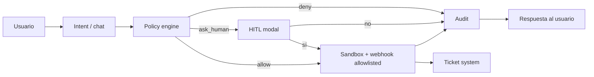
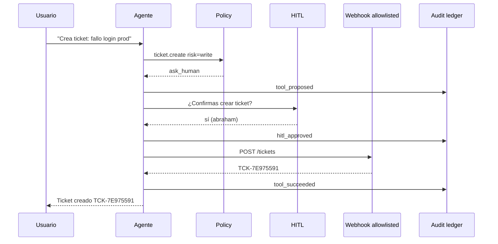
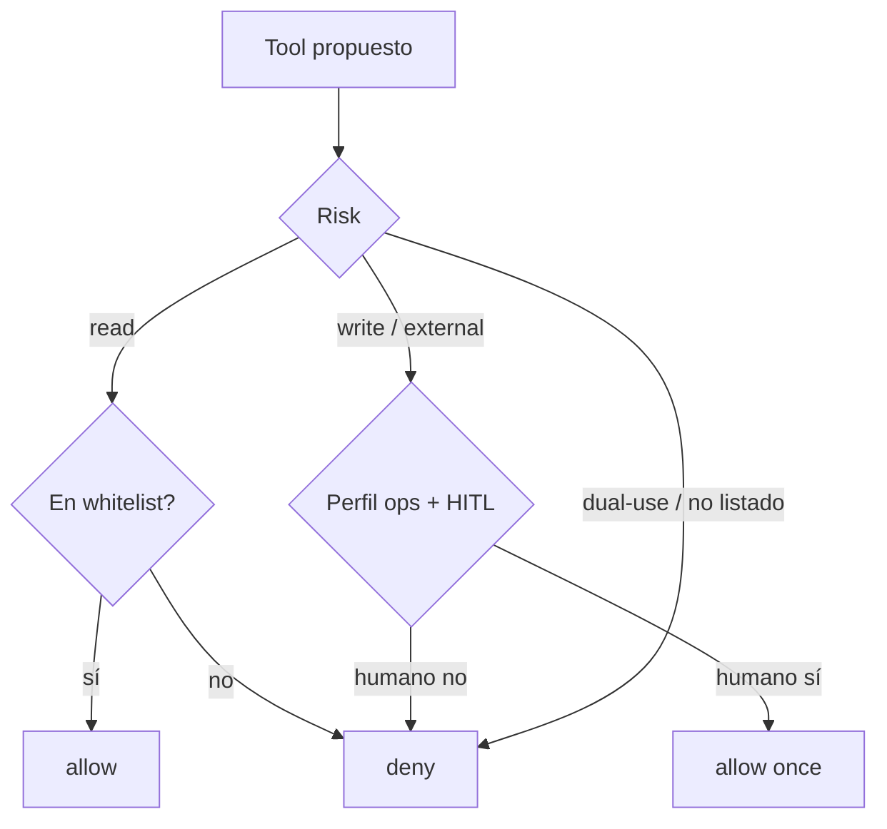

# Agentes que hacen cosas (sin volverse peligrosos): Caso 3 con Zyrabit — HITL, policy y audit

**Subtitle:** Cómo un integrador monta `chat → policy → tool → audit` en local, con diagramas, setup reproducible y casos de uso reales.

**Tags sugeridos:** AI Agents, MCP, Local LLM, DevOps, Open Source, Security

---

## El problema que nadie dice en voz alta

Todo el mundo quiere un agente que *haga* cosas: abrir tickets, avisar a Slack, pegarle a un ERP.

El atajo malo es darle shell libre (o un kit tipo Kali) al modelo. El atajo bueno —y el que Zyrabit está construyendo— es:

> **Operador con llaves, jaula y bitácora.**

Este post documenta el **Caso 3**: un dev/integrador pide *“crea un ticket de fallo de login en prod”*. El agente **no** ejecuta a ciegas. Propone un tool, una **policy** decide, un humano confirma (HITL), el tool corre solo si está **allowlisted**, y todo queda en **audit**.

Puedes replicarlo hoy con el demo del fork (sin Jira real):  
`examples/case3-hitl-ops/` en el repo.

---

## Diagrama 1 — Arquitectura mental



En producto completo (Zyrabit Platform) además envuelves PII in/out y RAG (“cita o calla”). El Caso 3 se centra en la **rama de acción**.

---

## Diagrama 2 — Secuencia del happy path



Corrida real del demo (sample):

- Ticket: `TCK-7E975591`
- Priority: `high`
- Requester: `abraham`

---

## Cómo montarlo (replicable)

### 0. Repo

Usa el fork (o el upstream cuando mergeen el ejemplo):

```bash
git clone https://github.com/Abraham1432/zyrabit-SLM.git
cd zyrabit-SLM
git checkout demo/case3-hitl-ops   # rama del demo
```

### 1. Levanta el inbox mock (simula Jira/Linear/n8n)

```bash
python3 examples/case3-hitl-ops/scripts/mock_ticket_server.py
# http://127.0.0.1:8765
```

### 2. Ejecuta el Caso 3

```bash
python3 examples/case3-hitl-ops/scripts/run_case3.py \
  --profile ops \
  --approve yes \
  --title "Fallo de login en prod" \
  --priority high \
  --requester abraham
```

### 3. Prueba los frenos

```bash
# Deny — tool ofensivo de ejemplo
python3 examples/case3-hitl-ops/scripts/run_case3.py --profile ops --deny-tool nmap.scan

# HITL reject
python3 examples/case3-hitl-ops/scripts/run_case3.py --profile ops --approve no
```

### 4. Mira las pruebas

- `out/tickets.jsonl` — side effects
- `out/audit.jsonl` — quién aprobó qué

---

## Diagrama 3 — Matriz de decisión



Regla de oro de producto:

| Perfil | Qué puede | HITL |
|---|---|---|
| `safe` (Lite default) | RAG, extract, health | casi nunca |
| `ops` | + webhooks allowlisted | writes = ask |
| `admin` | config / ingest masivo | cambios irreversibles = ask |

El modelo **no** se auto-promueve de `safe` a `admin`.

---

## Casos de uso reales (para copiar el patrón)

### 1) Incident response interno
*“Abre un P1 en Jira: API 500 en checkout.”*  
Policy ask → on-call aprueba → webhook Jira → audit para postmortem.

### 2) Soporte L2
*“Crea ticket en Linear con el resumen del PDF del cliente.”*  
Antes: RAG resume el PDF (con citas). Después: `ticket.create` con el resumen **ya redactado** (PII mask).

### 3) Ops de contenido / marketing
*“Avisá al canal #launch que el landing ya está en beta.”*  
`webhook.notify` a Slack/n8n allowlisted → HITL del PM.

### 4) Cumplimiento / hospital / fintech
*“¿Hubo acceso a expediente X?”* → solo tools `read` + audit.  
Cualquier write a sistemas clínicos = HITL + allowlist corta.

### 5) Integrador ERP
*“Registra orden de compra borrador.”*  
Tool ERP en sandbox; deny si el destino no está en la lista; firmas HMAC en el webhook (como el profile n8n del compose).

### 6) Developer experience del propio Zyrabit
*“El contenedor no arranca.”*  
Hoy el MCP real ya tiene `check_system_status` / `suggest_fix` (read). El Caso 3 es la evolución: de diagnosticar a **actuar** con freno.

### 7) Lo que explícitamente NO es un caso de uso del producto default
Automatizar reconnaissance, exploits o “armar tools de Kali”.  
Eso rompe la narrativa soberana/enterprise. Deny-by-default + no ship de esa superficie.

---

## De demo → Platform (roadmap corto)

1. **Lite DX** — un contenedor `:8080` (ya en el plan DX).
2. **Policy como contrato** — YAML/API deny-by-default (este demo).
3. **HITL en la Web UI** — el modal que hoy simulamos con `--approve`.
4. **3–5 tools de negocio** — no 50: ticket, notify, ingest, extract, health.
5. **Audit consultable** — pantalla “qué hizo el agente”.

---

## Por qué esto importa frente a Open WebUI / AnythingLLM / Dify

Ellos ganan chat UX o workflows.  
Zyrabit puede ganar **time-to-trust**: misma acción, pero con PII, allowlist, HITL y ledger.

El Caso 3 es la demo que un comprador enterprise entiende en 60 segundos:

> “Si pido algo peligroso, no pasa. Si pido algo útil, yo confirmo y queda registrado.”

---

## CTA

- Demo: `examples/case3-hitl-ops/README.md`
- Mapa: `docs/engineering/AGENT_TOOL_RUNTIME_MAP.md`
- Plan DX Lite-first: `docs/engineering/DX_SIMPLIFICATION_PLAN.md`
- Fork de trabajo: https://github.com/Abraham1432/zyrabit-SLM

Clona, corre los tres comandos, y ya tienes una historia reproducible para tu propio post, workshop o pitch.

---

*Borrador para Medium — Sep 2026. Pega este Markdown en Medium (o Ghost/Hashnode). Los bloques mermaid se ven en GitHub; en Medium puedes exportarlos a imagen con mermaid.live.*
